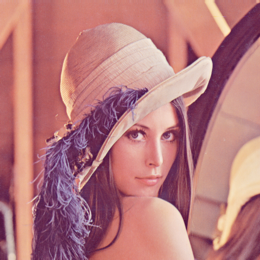

# POBR Lab1
## Task 1

Steps to achieve images below are stored in the file [notes.txt](notes.txt).

#### Helmets
 | 
---|---
 | 

#### Chairs
 | 
---|---

## Task 2
#### Lena
 | 
---|---

#### Program output
```
Count of pixels with lightness in range     0 -  31:      0
Count of pixels with lightness in range    32 -  63:   1922
Count of pixels with lightness in range    64 -  95:  44226
Count of pixels with lightness in range    96 - 127:  42167
Count of pixels with lightness in range   128 - 159:  70026
Count of pixels with lightness in range   160 - 191:  72611
Count of pixels with lightness in range   192 - 223:  30356
Count of pixels with lightness in range   224 - 255:    836
Total pixel count: 262144
```
