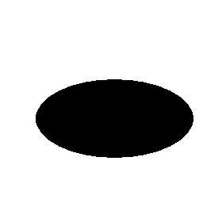

# POBR Lab3
## Task 1

 |  | 
---|---|---
  |  |  

Results:
```
Task1
File: ../black-white/elipsa.dib, S=15379, L=440, W3=0.000883883, M1=0.199721, M7=0.00633274
File: ../black-white/elipsa1.dib, S=10086, L=682, W3=0.915667, M1=0.270997, M7=0.0148704
File: ../black-white/kolo.dib, S=7621, L=276, W3=-0.108137, M1=0.159157, M7=0.00633274
File: ../black-white/prost.dib, S=7301, L=392, W3=0.294166, M1=0.280783, M7=0.00694124
File: ../black-white/troj.dib, S=13310, L=550, W3=0.344834, M1=0.262588, M7=0.0092576
```

## Task 2
 | 
---|---

Results:
```
Task2
File: ../arrows/strzalki_1.dib
Arrow R=:0, angle=4.76364deg, S=7194, L=490, W3=0.629693, M1=0.353643, M7=0.0146531
Arrow R=:45, angle=42.7094deg, S=7157, L=425, W3=0.417159, M1=0.35262, M7=0.0145878
Arrow R=:90, angle=90deg, S=7194, L=490, W3=0.629693, M1=0.353643, M7=0.0146531
Arrow R=:135, angle=135deg, S=7157, L=425, W3=0.417159, M1=0.35262, M7=0.0145878
Arrow R=:180, angle=180deg, S=7194, L=490, W3=0.629693, M1=0.353643, M7=0.0146531
File: ../arrows/strzalki_2.dib
Arrow R=:0, angle=0deg, S=4184, L=304, W3=0.325784, M1=0.267658, M7=0.00742666
Arrow R=:45, angle=116.565deg, S=4152, L=259, W3=0.133878, M1=0.26826, M7=0.00747773
Arrow R=:90, angle=-90deg, S=4184, L=304, W3=0.325784, M1=0.267658, M7=0.00742666
Arrow R=:135, angle=45deg, S=4165, L=259, W3=0.132107, M1=0.26984, M7=0.00746406
Arrow R=:180, angle=165.964deg, S=4184, L=304, W3=0.325784, M1=0.267658, M7=0.00742666
```
